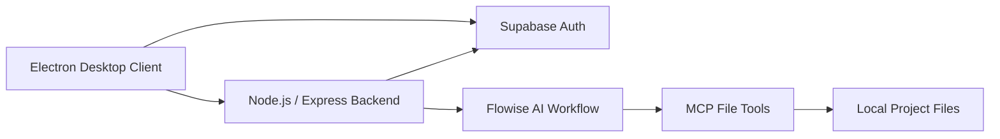

# Orcheus AI

**Desktop AI coding assistant powered by Flowise**

[Русская версия / Russian documentation](README.ru.md)

Orcheus AI is a desktop application that connects a local development environment with AI workflows running in Flowise.

The application allows a user to chat with an AI agent, generate project files, browse the generated file tree, inspect source code, and let the AI incrementally read, search, create, modify, and delete project files through MCP-style filesystem tools.

The project was developed as my final capstone project for the **Information Systems and Programming** program in 2026.

---

## Highlights

- **Desktop AI assistant** built with Electron
- **Flowise integration** for AI workflows
- **Supabase authentication** with JWT validation
- **Node.js / Express backend proxy**
- **MCP file tools** for AI-assisted project editing
- **SSE streaming** for real-time progress updates
- **Rate limiting** and backend request validation
- **Protected Flowise credentials** — secret tokens stay on the server
- Built-in **file tree and source code viewer**
- Project files can be generated and modified directly from the AI workflow

---

## Architecture



The Electron client communicates with a separate backend instead of connecting to Flowise directly.

This keeps Flowise credentials on the server and allows the backend to handle authentication, rate limiting, request validation, and MCP filesystem operations.

---

## Tech Stack

### Desktop
- Electron
- JavaScript
- HTML / CSS

### Backend
- Node.js
- Express
- Supabase
- JWT authentication

### AI & Automation
- Flowise
- LLM APIs
- MCP-style filesystem tools
- Server-Sent Events (SSE)

---

## Main Features

### AI Chat

Users can send requests to a Flowise-powered AI workflow directly from the desktop application.

The application displays progress updates and generated results in the interface.

### Project File Generation

AI responses can be converted into project files and written to a selected local project directory.

### File Browser

The desktop UI provides:

- hierarchical file tree
- collapsible folders
- file-type icons
- source code preview
- copy-to-clipboard functionality

### MCP File Operations

The backend exposes authenticated filesystem operations that allow the AI workflow to work with an existing project incrementally.

Supported operations include:

- list files
- read files
- write files
- search inside files
- delete files

### Authentication

Users authenticate through Supabase.

The backend validates Supabase JWT tokens before allowing access to protected AI and filesystem operations.

### Security

The project includes several security measures:

- Flowise secret token stored only on the backend
- JWT authentication
- request rate limiting
- path traversal protection
- project-root validation
- file-size limits
- Electron `contextBridge` isolation

---

## Project Structure

```text
orcheus-ai/
├── backend/              # Express backend and API
├── Flowise/              # Flowise-related project resources
├── src/
│   ├── main/             # Electron main-process modules
│   ├── renderer/         # UI components and application state
│   └── shared/           # Shared utilities
├── supabase/             # Supabase-related resources
├── main.js
├── preload.js
├── flowise-save.mjs
├── schema.sql
└── package.json
```

---

## Getting Started

### Requirements

- Node.js 18+
- Supabase project
- Flowise instance and workflow

### Install dependencies

```bash
npm install
```

### Configure the backend

Create `backend/.env`:

```env
FLOWISE_URL=https://your-flowise-server.com
FLOWISE_TOKEN=your-secret-token
FLOW_ID=your-flow-id

SUPABASE_URL=https://your-project.supabase.co
SUPABASE_ANON_KEY=your-anon-key

PORT=3001
```

### Start the backend

```bash
cd backend
node index.js
```

### Start the Electron application

```bash
npm start
```

---

## Build for Windows

```bash
npm run build
```

The packaged application is generated in the `dist/` directory.

---

## Project Status

Orcheus AI was developed as a **capstone / portfolio project**.

The local development setup was the primary environment used during development. Deployment of the backend and Flowise components to a remote server may require additional configuration depending on the infrastructure and network setup.

---

## Documentation

For the more detailed Russian documentation, including API examples and MCP endpoint descriptions, see:

**[README.ru.md](README.ru.md)**

---

## Author

**Anton Medvedev**

Junior AI Integration & Automation Developer

GitHub: [@Medvedev-Anton](https://github.com/Medvedev-Anton)